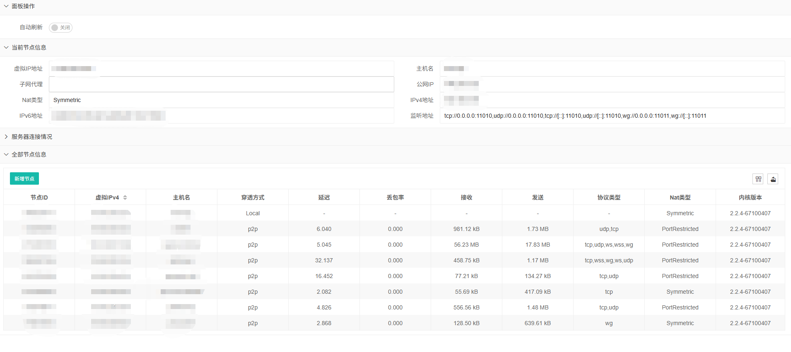

# EasyTier-Monitor

> EasyTier 是一个P2P组网的工具，可以在linux windows等设备上运行
> EasyTier 运行起来之后 想看到具体连接的节点 只能通过 cli工具去查看 对我来说太麻烦了，
> 我想要新加了设备之后，在某一个后台就能看到连接状态 所以开发了这个简单的小工具 
> 目前在 windows 和 linux 上测试正常


## 部署说明
1. 拉取代码
2. 使用go build  进行编译
3. 部署使用即可 
4. 注意：需要把 EasyTier-Monitor.json配置文件 放到执行文件的同级目录 

## linux 下 service文件参考  
> /etc/systemd/system/EasyTier-Monitor.service
```
[Unit]
Description=EasyTier-Monitor
After=syslog.target
After=network.target
[Service]
Type=simple
User=root
Group=root
WorkingDirectory=/app/easytier
ExecStart=/app/easytier/EasyTier-Monitor
Restart=always
RestartSec=10


[Install]
WantedBy=multi-user.target
```


## 界面截图


## 功能点
 - [x] Peer节点查看
 - [x] 当前节点信息查看
 - [x] 点击按钮跳转官方配置工具
 - [x] 连接服务节点状态查看

## 技术框架
 后端： golang  前端：layui